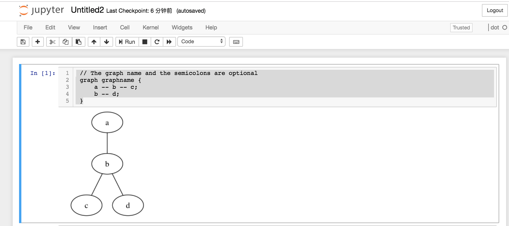

# Dot Kernel

The dot kernel for jupyter!


## Install

```
pip install dot_kernel
```

Run using:

```
jupyter notebook
```

Select new -> dot


and try run this:

```
 // The graph name and the semicolons are optional
 graph graphname {
     a -- b -- c;
     b -- d;
 }
```

You will see:



## TODO

1. update [this](https://github.com/jupyter/jupyter/wiki/Jupyter-kernels).
2. add more render tools not just `dot`
3. add more filetype support not just `png`
4. auto indent
